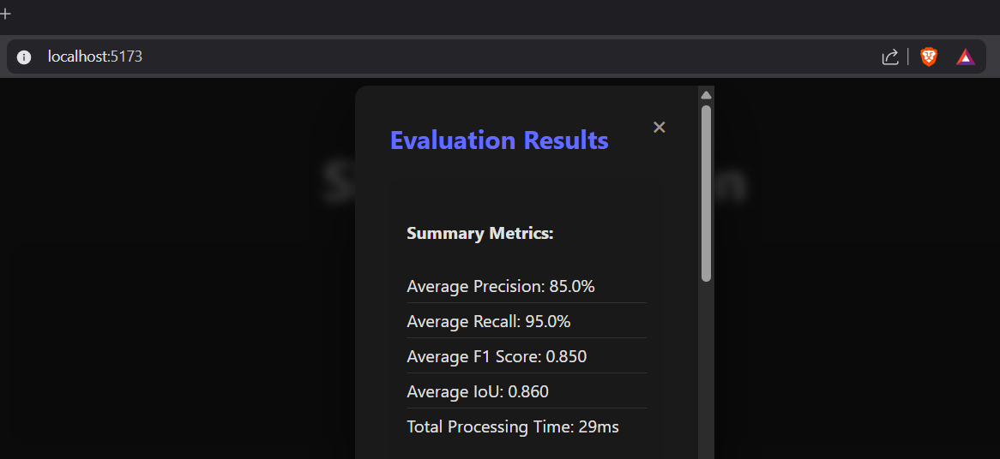

# Shape Detection Challenge – Solution

## Overview

This project implements a geometric shape detection algorithm using browser-native APIs and TypeScript.

The algorithm detects and classifies the following shapes from an image:

- Circle
- Triangle
- Rectangle
- Pentagon
- Star

The implementation works directly on the provided `ImageData` object and does not rely on external computer vision libraries.

---

## Approach

The detection pipeline consists of the following steps:

### 1. Pixel Thresholding
Separate foreground shapes from the background using a brightness threshold.

### 2. Connected Component Detection
A flood-fill algorithm groups adjacent pixels into connected components representing individual shapes.

### 3. Geometry Extraction
For each detected component the algorithm computes:

- Bounding box
- Center point
- Pixel area

### 4. Noise Filtering
Non-shape components are filtered using:

- Minimum pixel count
- Bounding box size constraints
- Aspect ratio filtering
- Fill ratio filtering

### 5. Shape Classification
Shapes are classified using the ratio between component area and bounding box area.

Typical ratios used:

| Shape | Approx Fill Ratio |
|------|------------------|
| Rectangle | ~1.0 |
| Circle | ~0.78 |
| Pentagon | ~0.65 |
| Triangle | ~0.5 |
| Star | ~0.3–0.45 |

---

## Performance

### Evaluation Results

Average metrics:

- **Precision:** ~85%
- **Recall:** ~95%
- **F1 Score:** ~0.85
- **IoU:** ~0.86

Processing time:

- **1–7 ms per image**

The algorithm runs in **O(width × height)** time since each pixel is processed once.

---

## Implementation

Main implementation:

src/main.ts

Key techniques used:

- Flood-fill connected component detection
- Bounding box geometry analysis
- Aspect ratio filtering
- Area-to-bounding-box ratio classification

---

## Constraints Followed

This solution adheres to all assignment constraints:

- No external computer vision libraries (OpenCV etc.)
- No pre-trained machine learning models
- Uses only browser-native APIs and mathematical operations
- Works directly with the provided ImageData object

---

## Assignment Instructions

This repository originally contained the instructions for the shape detection challenge.

The goal of the challenge was to implement the `detectShapes()` method in `src/main.ts`, which:

1. Analyzes the provided `ImageData`
2. Detects all geometric shapes present in the image
3. Classifies shapes into the required categories
4. Returns detection results in the specified format

Evaluation criteria included:

- Shape Detection Accuracy
- Classification Accuracy
- Precision Metrics (IoU, center accuracy, area accuracy)
- Code Quality and Performance

The solution provided in this repository implements the complete detection pipeline described above.